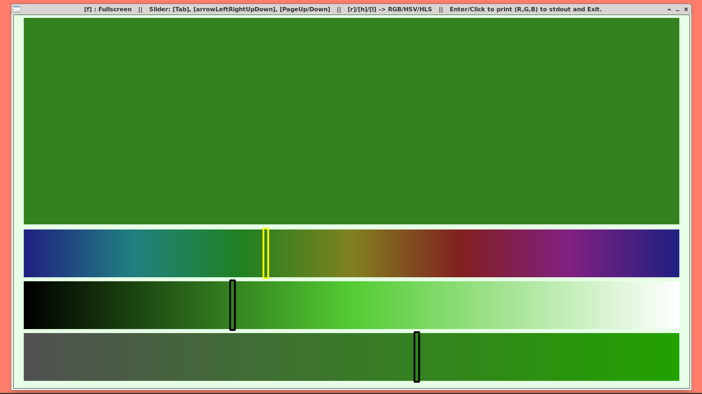
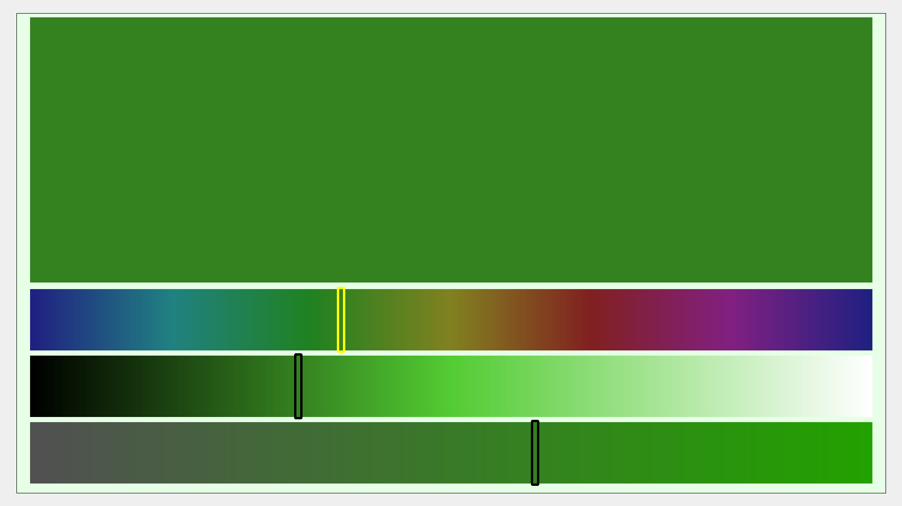

# colorChoice

<b>Why colorChoice</b> if there are so many color selection dialogs and tools? The answer is: because there is none out there which provides a large area showing the selected color and except an old in Tcl written Tk using code there is none out there showing the very helpful information about currently selectable colors in the sliders (if you are aware there is one, please let me know, so that I can list it here). Maybe you have already noticed that color perceoption is highly dependent on the color area surrounding colors, so the larger the area with the selected color the more genuine the visual impression of it. 

<b>colorChoice</b> is only about you and the colors. In Fullscreen mode there is nothing else, except colored strips showing all colors you can reach with next click or slider move, equipped with markers around the chosen color in all three color channels. 

colorChoice is pure Python code using the OpenCV module. It allows to visually select a color using RGB or HSV/HSL sliders (you know the color mode from the color of the active slider color marker) and outputs the chosen color in both hexadecimal and RGB format to stdout along with exact or nearest css3 color name. 

Both keyboard-only and mouse-only interaction allow to adjust color values and provides real-time feedback through a large area with chosen color showing which color will result from moving a slider to a new position by displaying this color in the slider strip.

# Key Features:
<ul><li><b>TEXT- and ICON/BUTTON FREE</b> Fullscreen Mode</li>
</li><li><b>RGB, HSL, HSV Modes:</b> Switch between different color models (RGB, HSV, HLS) using the r, h, and l keys.
</li><li><b>	Interactive Sliders:</b> Use Tab to change active color channel and arrow keys and PageUp/PageDown to adjust the color channel values. Move all three sliders at the same time using the Up/Down arrow keys. The sliders are visualized as horizontal strips of colors. Hit Enter to confirm color selection and exit the application. 
</li><li><b>Mouse Input:</b> Clicking inside the sliders adjusts the color values, while clicking in the upper large square with selected color confirms the color selection and exits the application.
</li><li><b>Fullscreen Mode</b>: Pressing the f key switches to <b><i>TEXT-FREE</i></b> fullscreen mode.
</li><li><b>Output:</b> Upon confirming a color with Enter or mouse click, the color is printed to stdout in both hex and RGB formats.
</li><li><b>Color Name:</b> In addition to #RRGGBB and rgb(R,G,B) output the exact or nearest css3 color name is determined and printed.
</li></ul>

The pure Python application is build following the guidelines of the oOo approach to usage of own computer for private purposes and programming it, so don't be surprized to see unusual code structure you are encouraged to change in order to adapt the application and code to your own preferences. Ease of customization has a high priority according to the oOo guidelines, so all the apllication GUI shaping constant values are provided in the first lines of the code inviting to play around with them. Appropriate naming of variables makes the code hopefully self-explaining  and therefore not needing extensive documentation. 

Why OpenCV where there is Tkinter, GTK, PyQt5 and plenty of other GUI application libraries? I mean because with  OpenCV it is sooo easy to show an IMAGE and if you think very deep about it you will find out that all applications come down to showing an image and getting user keyboard and mouse response to it. OpenCV makes it extremely easy to display an image ... See the code, become fascinated about its brevity and simplicity, and build your next custom Python application upon OpenCV as a GUI library ?
